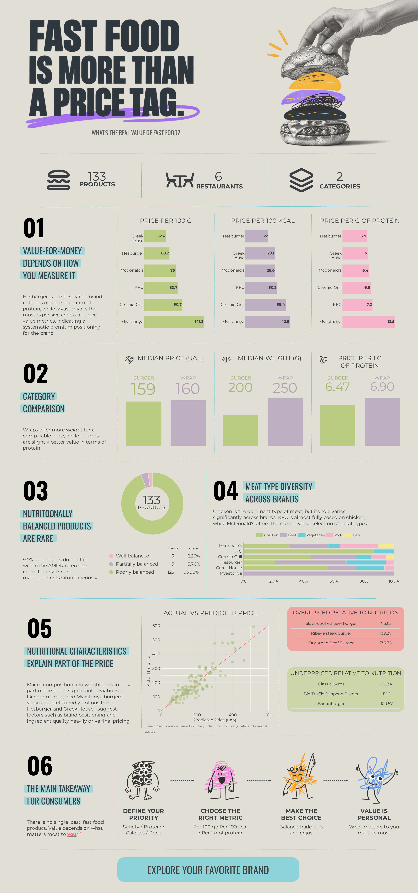
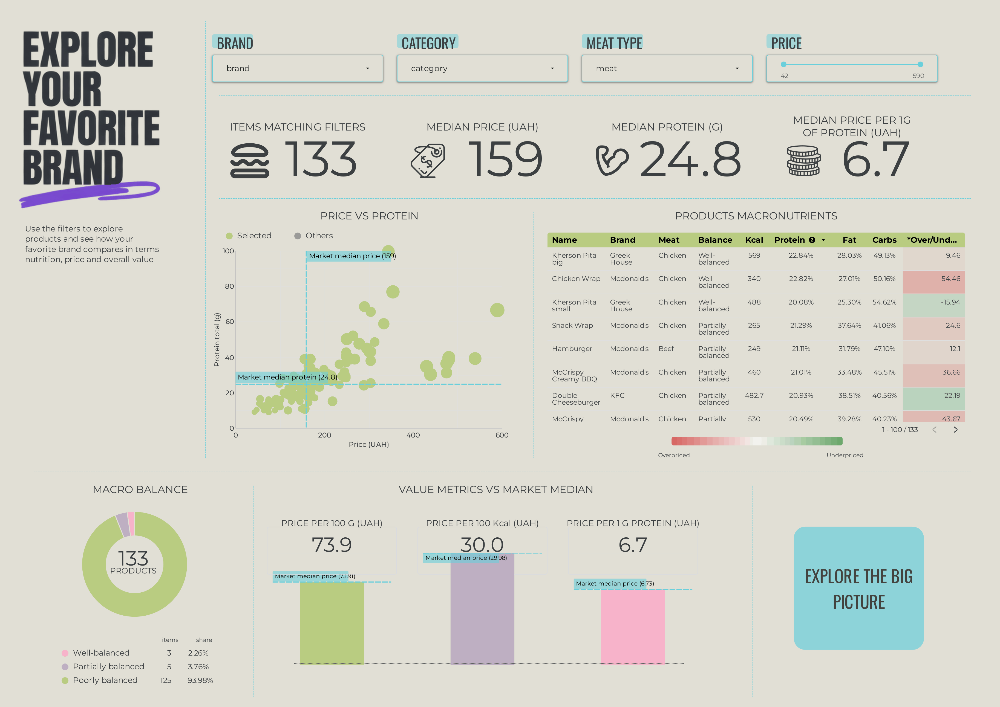

# Fast Food Value & Nutrition Analysis: Ukrainian Market

Which burger or wrap from Ukrainian fast food chains actually gives you the best value for your money - and which brands charge more without delivering greater nutritional value? [A self-collected dataset](https://docs.google.com/spreadsheets/d/1d7W7T5JyjUex_2a9FeAd1OoWzptuCIGnu_q_Txg_N9A/edit?usp=sharing) of prices and nutritional data, analyzed end-to-end and presented as a data-story infographic plus an interactive "explore your favorite brand" dashboard.

## 🔗 Live dashboard

[Looker Dashboard](https://datastudio.google.com/reporting/f97b01df-169f-481c-b4f8-18209d8d1677)

### 📊 Dashboard Preview




## 📓 Google Colab Notebooks

[Fast Food Value & Nutrition Analysis: Ukrainian Market](https://colab.research.google.com/drive/1cJtuUsdG453Gi5gM0iYSJkTrNS58Bc4O?usp=sharing)

---

## 📌 Research question

> Which burgers and wraps from Ukrainian fast food offer the best value in terms of price and nutritional composition, and do some brands charge more without providing greater nutritional value? How closely do these products match a balanced macronutrient distribution?

Unlike the other projects, the data here isn't from an open dataset - it was manually collected from the official websites/apps of six Ukrainian fast food chains on a single date, making this a self sourced dataset.

- Scope: 133 burgers and wraps, 6 brands (McDonald's, KFC, Gremio Grill, Hesburger, Greek House, Myastoriya)
- Data: price, weight, and macronutrients (calories, protein, fat, carbs, sodium) both per serving and per 100g

---

## 🗂️ Repository structure

```
├── notebooks/
│   └── fastfood.ipynb
│
├── data/
│   └── fast_food_nutritional_value.xlsx
│
├── exported_data/
│   └── ukrainian_fast_food_analysis.csv
│
├── dashboard_images/
│   ├── beyond_the_price_tag.png
│   └── explore_your_brand.png
│
└── README.md
```

---

## 🧱 Data Architecture

```
Manually collected prices & nutrition data (Excel)
      │
      ▼
Google Colab
      ├── Value-for-money metrics
      ├── Macro balance scoring against AMDR reference ranges
      ├── Nutrition-based pricing model for identifying 
      │       overpriced or underpriced products
      │
      └── Product level CSV table with all calculations
              │
              ▼ 
      Looker Studio (infographic 'Beyound the price tag', interactive 'Explore
                        your favorite brand')

```

---

## 🛠️ Tech stack

- **Python** - Google Colab
- **Looker Studio** - dashboard and data visualization

---

## 📊 Dashboard pages

| Page | Metrics |
| :--- | :--- |
| Infographic ('Beyond the Price Tag') | Value-for-money by brand, Category comparison, Macro balance overview, Meat type diversity, Over/Underpriced products, Consumer takeaway |
| Interactive ('Explore Your Favorite Brand') | Filterable by brand, category, meat type and price - Price vs. protein scatter, Product-level macro table with over/underpriced indicator, Macro balance, Value metrics vs. market median |
---

## 🔬 Methodology notes

- **Value-for-money is measured three ways** (price per 100g, per 100 kcal, per gram of protein) deliberately, because these can rank brands differently depending on what a consumer actually cares about.
- **Macro balance** is scored against the AMDR (Acceptable Macronutrient Distribution Range) reference for adults, using a stricter sub-range (protein 20-30%, fat 20-30%, carbs 40-60% of calories) rather than an arbitrary custom "ideal" ratio.
- **Over/underpriced products** are identified using a linear regression of price on protein, fat, carbs, and weight.

## 🔍 Key findings

1. **Value-for-money depends heavily on how it is measured.** Hesburger is the best value brand in terms of price per gram of protein (5.87 uah/g), while Myastoriya is the most expensive across all three value metrics (per 100 g, per 100 kcal, per 1g of protein), indicating a systematic premium positioning for the brand.

2. **Category level:** wraps offer more weight for a comparable price, while burgers are slightly better value in terms of protein (159 vs. 160 uah median price; 6.47 vs. 6.90 uah/g of protein).

3. **A nutritionally balanced product is rare in this market.** 94% of products do not fall within the AMDR reference range for any three macronutrients simultaneously. Only 3 out of 133 items (McDonald's Chicken Wrap, two Greek House pitas) met all three criteria.

4. **Chicken is the dominant type of meat**, but its role varies significantly across brands: KFC is almost fully based on chicken, while McDonald's offers the most diverse selection of meat types.

5. **Nutritional characteristics explain only part of the price**. A model based on protein/fat/carbohydrates/weight indicates that several Myastoriya burgers (Slow-cooked beef, Ribeye steak, Dry-Aged Beef) cost significantly more than their nutritional composition would suggest - likely due to brand positioning and higher-quality or more expensive ingredients. By contrast, the Greek House Classic Gyros and the Hesburger VEKE Vegetarian Double Cheeseburger turned out to be noticeably cheaper than their 'fair' price, meaning they are the best deals in terms of objective nutritional value per uah.

6. **The main practical takeaway for consumers:** the cheapest product per 100g isn't always the cheapest source of protein or calories, so 'value' should be determined based on your personal priorities (satiety vs. protein vs. simply being cheap), rather than on a single universal metric.

---
## ⚠️ Known limitations

- **Sample size is small** (133 products, 6 brands) collected on a single date - prices and menus change over time, and this is a snapshot, not a tracked trend.
- **Sodium data is missing** for half of the brands (chains that don't disclose it), so sodium was excluded from the macro balance and value analyses.
